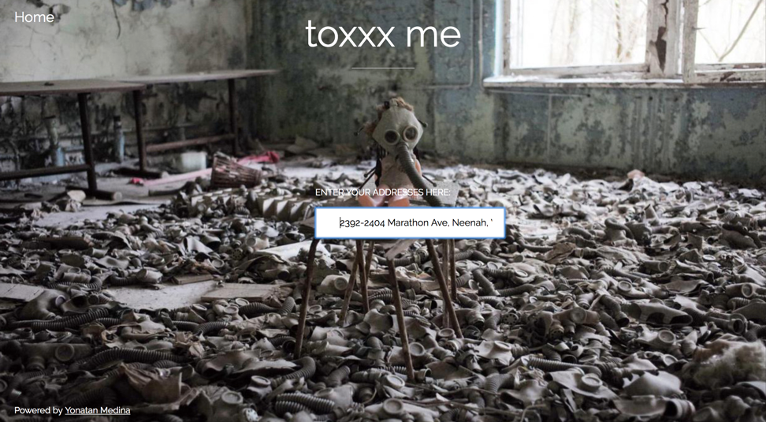
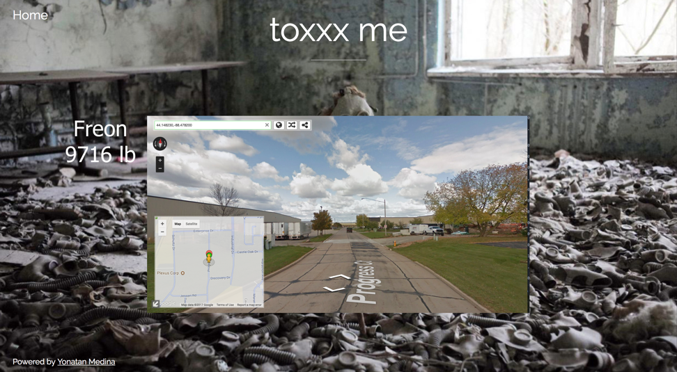

# Toxxxme

## Overview

Toxxxme is a simple but powerful website that shows people their exposure to environmental toxicity by having them type in their address.

Using the Google Maps API and publically available data sources, a user will be taken on a virtual tour of his/her exposure to toxicity supplemented with locational data and other information.


## Data Model

The application will have a SQL database which is a clone of data data from the Federal environmental database (TOXMAP). Two tables will be linked by reference (by facility serial #) The first table will include every facility on record, it's location and other metadata about it. The second table will list all toxic releases by each facility, where each entry is a toxic release.


Table 1:

```javascript
{
	('00602BXTRF111CO',110002085207,'BAXTER HEALTHCARE CORP, FENWAL DIV','111 COLON ST','AGUADA','PR','00602',72003,'AGUADA','18.379830','-67.184530'),
	('00602BXTRHRD115',110007807258,'DADE DIAGNOSTICS OF PR INC','RD 115 KM 226','AGUADA','PR','00602',72003,'AGUADA','18.380797','-67.191301')
  }

```

Table 2:

```javascript
{
	('98421SLRFN3001M',1394080394392,'Ethylbenzene','100-41-4','1994','4290.00000000000000000','',NULL,NULL,NULL,NULL),
	('98421SLRFN3001M',1394080394378,'Toluene','108-88-3','1994','22097.00000000000000000','',NULL,NULL,NULL,NULL)
}
```


## [Link to Commented First Draft Schema](db.js) 

(___TODO__: create a first draft of your Schemas in db.js and link to it_)

## Wireframes

/ - page with form for inputting an address (home)



/myPlace - page for showing all shopping lists



## Site map

Here's a [complex example from wikipedia](https://upload.wikimedia.org/wikipedia/commons/2/20/Sitemap_google.jpg), but you can create one without the screenshots, drop shadows, etc. ... just names of pages and where they flow to.

Home Page (search box) -> myPlace (virtual tour using google maps api)
About

## User Stories or Use Cases


1. As a user, I can see where I've been exposed to toxicity in my life in an intuitive and visually appealing way
2. As an educator, I can show my students how close to home toxicity is
3. As a home buyer, I can be better informed as to buying a place in a non-polluted area
4. As an activist I can track and see which places have been polluted.

## Research Topics


* (5 points) Use a server side library we didn't cover (Sqlite)
* (4 points) Perform client side form validation using a JavaScript library
* (5 points) vue.js
    * used vue.js as the frontend framework; it's a challenging library to learn, so I've assigned it 5 points

14 points total out of 8 required points 


## [Link to Initial Main Project File](./documentation/server.js) 
## [Link to package.json](./documentation/package.json) 

## Annotations / References Used

(___TODO__: list any tutorials/references/etc. that you've based your code off of_)

